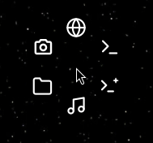

# tool-ring

A radial ring of launcher badges that pops up **around your mouse cursor** — a
Logitech-style tool ring for Wayland. Bind it to a key (e.g. `Super+G`), tap,
and click a badge to launch.



Built for Hyprland but works on any `wlr-layer-shell` compositor. The ring is
drawn as a transparent GTK4 overlay surface via
[gtk4-layer-shell](https://github.com/wmww/gtk4-layer-shell).

## How it works

- Reads the cursor position from `hyprctl cursorpos`.
- Picks the monitor under the cursor and clamps the ring so it stays on-screen.
- Draws N badges evenly around the cursor as SVG icons (this config ships 6).
- Click a badge → runs its command and exits; click outside / `Esc` → dismiss.

The pure geometry helpers (`ring_positions`, `place_ring_center`, `hit_test`,
`resolve_monitor`, …) are import-safe and unit-tested without a display.

## Requirements

- A `wlr-layer-shell` Wayland compositor (Hyprland, etc.)
- `python` with PyGObject (`gtk4`, `gtk4-layer-shell` typelibs)
- `hyprctl` (or adapt `parse_cursorpos` to your compositor's cursor query)

On Arch / CachyOS:

```sh
sudo pacman -S python-gobject gtk4 gtk4-layer-shell librsvg
```

## Install

```sh
git clone https://github.com/nethum529/tool-ring.git ~/Projects/tool-ring
ln -s ~/Projects/tool-ring/bin/tool-ring ~/.local/bin/tool-ring
```

Then bind it. On Hyprland:

```
bind = SUPER, G, exec, ~/.local/bin/tool-ring
```

## Configure the badges

Edit the `ITEMS` list near the top of `tool_ring.py` — each entry is an SVG icon
and a command:

```python
ITEMS = [
    {"svg": GLOBE_SVG,    "cmd": ["firefox", "--new-window"]},
    {"svg": TERMINAL_SVG, "cmd": ["kitty"]},
    {"svg": CLAUDE_SVG,   "cmd": ["kitty", "-e", "claude"]},
    {"svg": MUSIC_SVG,    "cmd": ["spotify"]},
    {"svg": FOLDER_SVG,   "cmd": ["dolphin"]},
    {"svg": CAMERA_SVG,   "cmd": ["sh", "-c", 'grim -g "$(slurp)" - | wl-copy']},
]
```

## Tests

```sh
python -m pytest
```
